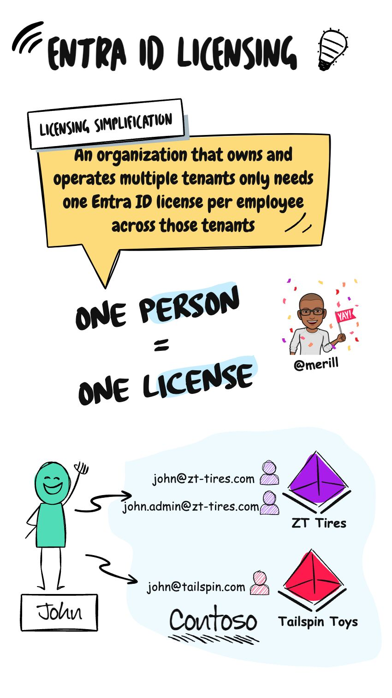
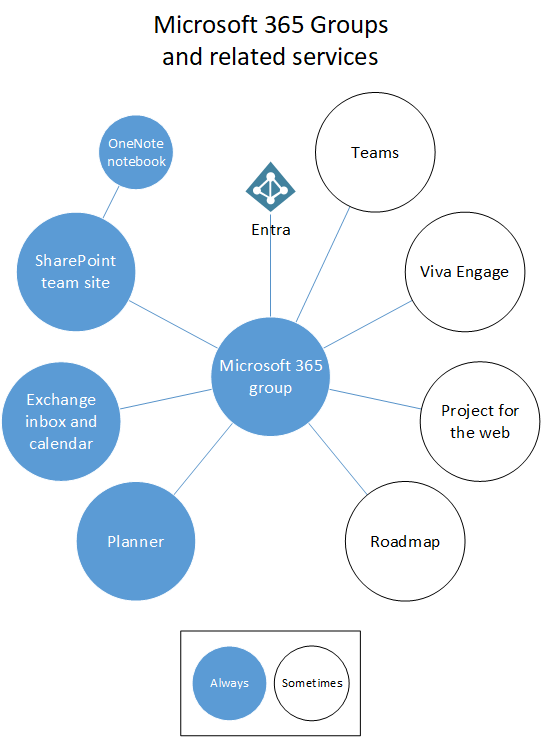
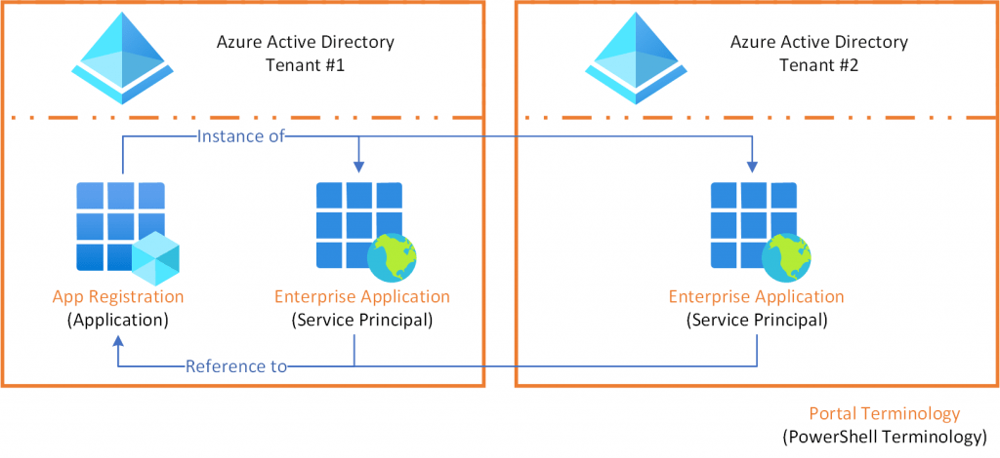
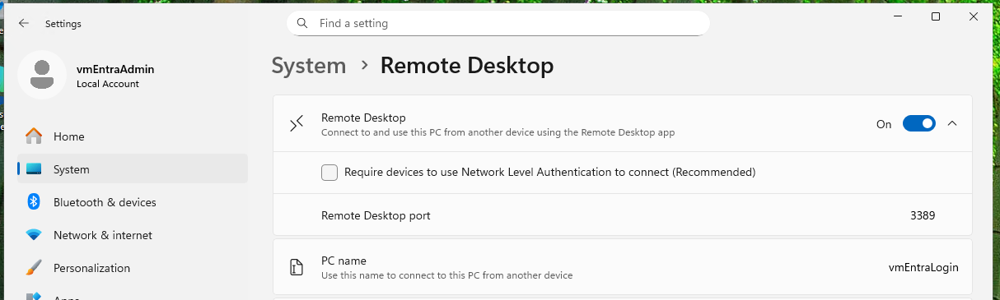
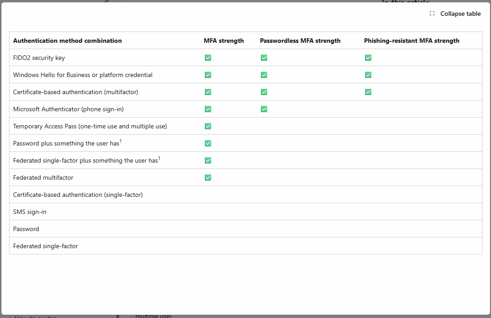
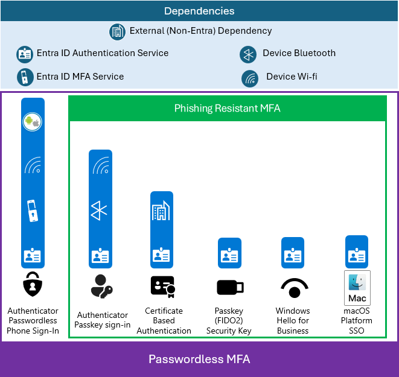
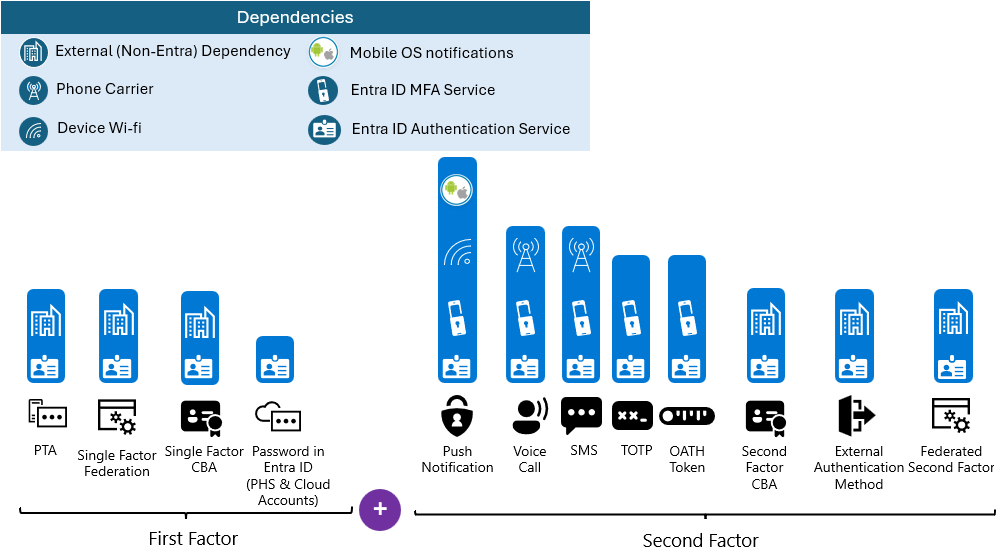
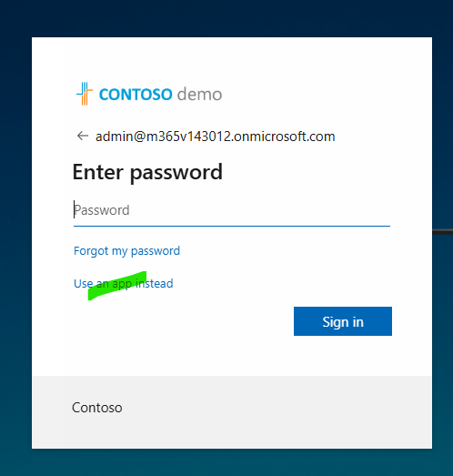

# FAQ

## Learning Path 1 - Explore identity and Microsoft

Use this section to build the foundation: identity concepts, modern Zero Trust principles, and the differences between core directory services.

> Authentication (AuthN) confirms who you are, while Authorization (AuthZ) decides what you're allowed to do. So, AuthN checks your identity, and AuthZ grants permissions based on that identity.

- Classic identity (Restrict everything to a secure network)
  - Disable MFA inside of the Company (Trusted Network)?
  - Implication on BYOD inside the Company?
- Zero trust identity (Protect assets anywhere with central policy)
  - Reduce the MFA frequency on a Managed Device > User Experience
  - Increase the MFA frequency for IT-Admin or Access to HR-Systems > Sensible asset

> Just-enough-access (JEA)
> Just-in-time (JIT)

- Identity and access management (IAM)
  - B2B collaboration: Guest users (Copy)
  - B2B direct connect: External user (No copy)

- Microsoft Entra Domain Services (Azure Active Directory Domain Services) = Limited AD in the cloud (Kerberos, LDAP, NTLM)
- Microsoft Entra ID = Cloud IdP (REST API, JSON)
- Active Directory Domain Services = AD on-prem (Kerberos, LDAP, NTLM)

> JSON Web Token (JWT) = Can be decoded (<https://jwt.io/>)

> Identity lifecycle (Join, Move, Leave)

## Learning Path 2 - Implement an identity management solution

Focus here on identity governance basics in operations: delegation models, emergency access, user defaults, and hybrid sign-in behavior.

> Administrative Unit (Delegate Limited Roles) vs Organizational Units (Delegate AD Permission)
> Application Administrator (+ App Proxy) vs Cloud Application Administrator (No App Proxy)

- Establish emergency access (BreakGlass -> No login): <https://learn.microsoft.com/en-us/azure/active-directory/roles/security-emergency-access>
  - Logs 1: <https://learn.microsoft.com/en-us/azure/azure-monitor/alerts/tutorial-log-alert>
  - Logs 2: <https://learn.microsoft.com/en-us/entra/identity/role-based-access-control/security-emergency-access>

- Default user permissions (Self-Service vs Managed by Admin): <https://learn.microsoft.com/en-us/entra/fundamentals/users-default-permissions>

- Custom security (Cloud, Entra private) vs extension attribute (Cloud, Entra public) vs custom attribute (on-prem, Exchange)

- User type: Member vs Guest (convert to Member = more access)

- Seamless single sign-on (SSO) = Primarily for Entra hybrid devices (not needed for Entra joined devices), hard to validate with Edge browser (cached credentials)

## Learning Path 3 - Implement an Authentication and Access Management solution

This section covers authentication controls in practice, including MFA strategy, Conditional Access tuning, lockout behavior, and risk-based policies.

- Conditional Access vs Default Security vs "per-user MFA" (legacy MFA portal)

- Authentication methods (MFA, passwordless, strength)
- Self-Service Password Reset (SSPR) -> No security questions for admins

- Smart Lockout vs User Lock (Not synced)
  - Verhalten mit PTA und ADFS (User Lock impact) vs PHS (User Lock no impact)
    - ADFS (External Lock [WAP], AD Lock = External locks must be higher)
    - PTA (Smart Lock + AD Lock = Smart locks must be higher)
    - PHS (just Smart Lock)
  - Smart Lockout to locations (IP ranges) instead of whole user account

- Login with Microsoft Entra ID (+ system-assigned managed identity in Azure)

- Conditional Access (exclude vs include, frequency, debugging)

- Risk policy (risky event vs risky user) {Hint: risky guest user in guest tenant}

- Azure roles (Key Vault options, etc.)

- Global Secure Access: <https://learn.microsoft.com/en-us/entra/global-secure-access/overview-what-is-global-secure-access>
  - Private vs Public

## Learning Path 4 - Implement Access Management for Apps

Use this part to distinguish app integration models and consent flows, and to decide when to use Enterprise Apps versus App Registrations.

- MDCA = Microsoft Defender for Cloud Apps (zuvor: MCAS = Microsoft Cloud App Security)
- CASB = Cloud access security broker (<https://www.microsoft.com/de-ch/security/business/security-101/what-is-a-cloud-access-security-broker-casb>)
- Enterprise App (SAML) vs Application Registration (OpenID (OIDC))
- Gallery (Verification by Microsoft, Template), Multi-Tenant App, Single-Tenant App
- User consent (Default allowed, restriction possible) vs tenant-wide consent (by admin)
- Example app: LastPass, Vertec, usw.
- Graph API over PowerShell vs Graph Explorer (REST API, JSON)

## Learning Path 5 - Plan and Implement an Identity Governance Strategy

Treat this section as your governance toolkit: lifecycle processes, PIM, KQL-driven analysis, and measurable security posture tracking.

- Lifecycle (Join, Leaver), Terms of use (ToS), Access review

- PIM
  > In the context of Entra ID (Azure AD), Privileged Identity Management (PIM) refers to a feature that helps organizations manage, control, and monitor access to privileged roles within Azure AD and other Microsoft cloud services

- KQL
  > KQL typically stands for "Kusto Query Language." Kusto is a query language used in Azure Data Explorer, Azure Monitor, and Azure Sentinel, among other Microsoft services. It's designed for querying large datasets quickly and efficiently. KQL is similar to SQL (Structured Query Language) but tailored specifically for these Azure services. It's commonly used for analyzing and querying data in cloud environments, especially for monitoring, logging, and analytics purposes.

- Secure Score (wait ~1 day for updates)

- Sign-in logs analysis (Workbooks, export, Sentinel, KQL examples/templates)

## More

This is a reference section with links, comparison tables, and implementation notes for common SC-300 lab questions.

### Study guide

[Study guide for Exam SC-300: Microsoft Identity and Access Administrator | Microsoft Learn](https://learn.microsoft.com/credentials/certifications/resources/study-guides/sc-300)

### Identity Provider (IdP)

> OpenID provider - OpenID Connect (OIDC) and/or SAML identity provider - Security Assertion Markup Language (SAML)

### W3C Decentralized Identifiers (DIDs)

<https://www.w3.org/TR/did-core/#a-simple-example>
> "id": "did:example:123456789abcdefghi#keys-1"

- Used in Product: "Entra Verified ID"

### System for Cross-Domain Identity Management (SCIM)

> SCIM 2.0 protocol for automatic provisioning. The service connects to the SCIM endpoint for the application, and uses the SCIM user object schema and REST APIs to automate provisioning and de-provisioning of users and groups.

### Common delegation scenarios

> When you delegate administrative tasks, you want to keep a few terms in mind:     Least Privilege – Just in Time – Just long enough

### Access Review

> Principle of least privilege

### Secure Score

> Identity Secure Score vs Microsoft 365 Secure Score

### Supported RDP properties

<https://learn.microsoft.com/en-us/windows-server/remote/remote-desktop-services/clients/rdp-files>

- authentication level:i:value
  - 0: If server authentication fails, connect to the computer without warning.
  - 2: If server authentication fails, show a warning, and choose to connect or refuse the connection.
- enablecredsspsupport:i:*value*
  - 0: RDP won't use CredSSP, even if the operating system supports CredSSP.
  - 1: RDP will use CredSSP if the operating system supports CredSSP.

### Managed Domain vs Federated Domain

- Managed domain = Entra ID (Azure) for internal users
- Federated domain = ADFS for internal users

### MFA Registration (Optional)

<https://aka.ms/mfasetup>
> The URL is for setting up multi-factor authentication (MFA) for Microsoft accounts. When users visit this URL, they are typically directed to a page where they can configure multi-factor authentication settings for their Microsoft accounts, adding an extra layer of security beyond just a password.

Source: <https://msportals.io>

### Login with Microsoft Entra ID (+ Managed Identity on Azure VM)

Role assignment prerequisites for Entra sign-in on Azure VMs.

<https://learn.microsoft.com/en-us/entra/identity/devices/howto-vm-sign-in-azure-ad-windows#configure-role-assignments-for-the-vm>

### Managed identity with Azure KeyVault

> see [path3_lab16_t5_keyvault.ps1]
<https://learn.microsoft.com/en-us/azure/frontdoor/managed-identity>

### App Registration Example

> Platform: Single-page application, mobile and desktop applications, iOS/macOS, Android

- Permission overview: <https://graphpermissions.merill.net/permission/>

- Business Application - LastPass
  - EN: <https://support.lastpass.com/s/document-item?language=en_US&sfdcIFrameOrigin=null&bundleId=lastpass&topicId=LastPass%2FFederated_Azure_AD_step3_create_login_app.html&_LANG=dede>
  - DE: <https://support.lastpass.com/s/document-item?language=de&sfdcIFrameOrigin=null&bundleId=lastpass&topicId=LastPass/Federated_Azure_AD_step3_create_login_app.html&_LANG=dede>
- Business Application - Vertec
  - <https://www.vertec.com/ch/kb/openid-connect/>

### Friendly Takeover, Internal admin takeover

Use this when a company must regain tenant admin control.

<https://learn.microsoft.com/en-us/microsoft-365/admin/misc/become-the-admin?view=o365-worldwide>

### Emergency Admin, Break-glass account

> Emergency access accounts are limited to emergency or "break glass" scenarios where normal administrative accounts can’t be used.
> Implement strict security controls (always)
> Validate break-glass accounts

<https://learn.microsoft.com/en-us/entra/identity/role-based-access-control/security-emergency-access>

### Entra Export

> Export Configuration Settings (+ Microsoft 365 Groups)

<https://github.com/microsoft/EntraExporter>
<https://office365itpros.com/2023/08/24/entraexporter-tool/>

### Microsoft 365 DSC

> Copy Tenant Settings, Tenant Configuration Drift

<https://microsoft365dsc.com/>

### Entra ID licensing (One Person = One License)

<https://www.linkedin.com/posts/merill_i-todays-blog-post-on-entra-id-licensing-activity-7209407252506558464-xR3z>
<https://techcommunity.microsoft.com/blog/microsoft-entra-blog/microsoft-entra-id-governance-licensing-clarifications/4164499>

{: width="300px"}
<!-- { width=300 } -->
<!-- { width=800 loading=lazy } -->

### Basic - Microsoft 365 Groups

<https://learn.microsoft.com/en-us/microsoftteams/office-365-groups>

### Basic - App Registration vs Enterprise Apps

Visual comparison of App Registration and Enterprise App.

<!-- 
    https://emilyvanputten.com/the-difference-between-azuread-app-registrations-and-enterprise-applications-explained/
-->

### Global Secure Access client

<https://learn.microsoft.com/en-us/troubleshoot/entra/global-secure-access/troubleshoot-global-secure-access-client-windows-issues>

Standalone: No
> A managed device joined to the onboarded tenant. The device must be either *Microsoft Entra joined* or *Microsoft Entra hybrid joined*. Microsoft Entra registered devices aren't supported.

Targeted Entra hybrid join (client-side, ohne SCP): <https://learn.microsoft.com/en-us/entra/identity/devices/hybrid-join-control#configure-client-side-registry-setting-for-scp>

### Login with Microsoft Entra ID (RDP Username Format)

- Username format (RDP): `AzureAD\\admin@[contoso].onmicrosoft.com`
- RDP file property: `username:s:AzureAD\\admin@[contoso].onmicrosoft.com`

### Authentication strengths & dependencies

<https://learn.microsoft.com/en-us/entra/identity/authentication/concept-authentication-strengths>

<https://learn.microsoft.com/en-us/entra/architecture/resilience-in-credentials>

### App Registration (Application) vs Enterprise App (Service Principal)

| Feature / Topic | App Registration (Application) | Enterprise App (Service Principal) |
|---|---|---|
| Core role | Developer object for app identity and configuration | Tenant-local instance used for access and operations |
| Portal blade | App registrations | Enterprise applications |
| Scope | Home tenant app definition | Per-tenant service principal (home tenant and/or guest tenant) |
| Created alone (without app registration) | No | Yes (for Gallery/non-Gallery SAML, App Proxy, some service principals) |
| Primary audience | Developers | IAM/Admin operations |
| Multi-tenant app | Configure supported account types | Created in each tenant after consent (including guest tenant) |
| OAuth/OIDC redirect URIs | Yes | No |
| API permissions (declared) | Yes | No |
| Secrets/certificates for app auth | Yes | No |
| Consent state (effective in tenant) | No | Yes |
| User/group assignment | No | Yes |
| Conditional Access targeting | No | Yes |
| SAML SSO settings | No | Yes |
| SCIM provisioning | No | Yes |
| App Proxy publishing | No | Yes |
| Global Secure Access (GSA) app access policies | No | Yes |
| Protocol focus | OAuth 2.0/OIDC  | SAML-based enterprise SSO and tenant access controls |
| Typical data format in auth flow | JSON (JWT tokens) | XML (SAML assertions) |
| Useful tools | JWT: <https://jwt.io/> | SAML: <https://www.samltool.io/> / <https://developer.pingidentity.com/en/tools/saml-decoder.html> |

### User-Assigned vs System-Assigned Managed Identities (Azure)

<https://learn.microsoft.com/en-us/entra/identity/managed-identities-azure-resources/managed-identity-best-practice-recommendations>
<https://medium.com/@venky89.ai/when-to-use-system-assigned-managed-identity-and-user-assigned-managed-identity-3dc6088c83e7>
(<https://medium.com/codex/leveraging-system-assigned-identity-in-azure-and-assigning-resources-to-an-entra-group-4734641a39f1>)

#### Core Difference

| Property | System-Assigned (SAMI) | User-Assigned (UAMI) |
|---|---|---|
|  Lifecycle  | Tied to the resource (deleted when the resource is deleted) | Independent (exists until manually deleted) |
|  Sharing / Scalability  | One identity per resource only | One identity can be shared across multiple resources (e.g. 4 VMs → 2 role assignments instead of 8) |
|  Custom Naming  | Auto-generated, not customizable | Named by you at creation time |
|  Creation  | Auto-created alongside the resource | Created separately as a standalone Azure resource, then attached |
|  Assignment to other resources  | Bound to a single resource; cannot be reassigned | Can be assigned to any number of resources across types |
|  Pre-deployment access  | Not available before the resource exists | Can be configured with role assignments before any resource is deployed |
|  Compliance / Approval overhead  | New identity created per resource (more approvals required) | Single identity reused across resources (fewer approvals) |
|  Audit logging  | Logs identify the specific resource that acted | Logs show the shared identity, not the individual resource |
|  Permission cleanup  | Automatic on resource deletion | Must be manually deleted; role assignments must be cleaned up separately |
|  Rate limit risk (rapid deployments)  | Risk of hitting Entra ID object creation limits (HTTP 429) | One Service Principal regardless of how many resources use it |

### Passwordless Sign-in (Zero Trust Lab - A)

Lab for a basic passwordless sign-in flow.

<https://microsoft.github.io/cloudlab/pswdlesspsi>

### Temporary Access Pass (Zero Trust Lab - B)

TAP is a temporary credential for passwordless onboarding.

<https://microsoft.github.io/cloudlab/pswdlesswhfb#step-5-enable-the-temporary-access-pass-policy>

